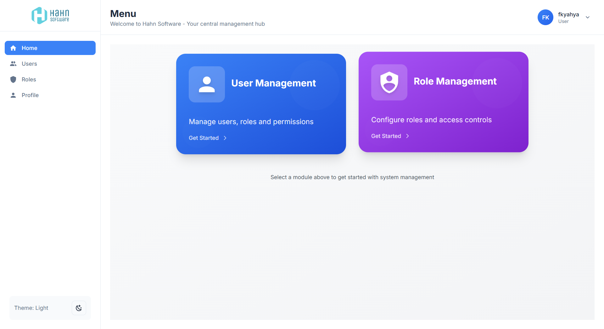

# Hahn Fullstack Application

    

## 🚀 Features & Requirements Coverage

### **1. Backend (Java/Spring Boot)** ✅

- ✅ **Spring Boot RESTful API** - Complete REST API with Spring Boot 3.5.0
- ✅ **JPA/Hibernate** - Full database interaction with Spring Data JPA
- ✅ **Entity Management** - Multiple entities: User, Role with relationships
- ✅ **CRUD Endpoints** - Complete CRUD operations for users and roles
- ✅ **Input Validation** - Comprehensive validation with annotations
- ✅ **Error Handling** - Graceful error handling with custom exceptions

### **2. Frontend (React.js)** ✅

- ✅ **Responsive UI** - Modern React 19.1.0 with functional components + hooks
- ✅ **React Router Navigation** - Multiple pages: Login, Register, Profile, Users, Role Management
- ✅ **API Integration** - Axios for backend communication
- ✅ **Forms Implementation** - Add/Edit forms for users and roles with validation
- ✅ **List Management** - Data tables with delete/edit options
- ✅ **State Management** - Context API (AuthContext, ThemeContext) + custom hooks

### **3. Database (SQL)** ✅

- ✅ **MySQL Database** - MySQL 8.0 for data storage
- ✅ **Initial SQL Script** - Complete `schema.sql` with database structure and sample data
- ✅ **Proper Schema** - Normalized tables with foreign key relationships

### **4. Git & Best Practices** ✅

- ✅ **Clean Code Principles** - Proper naming, separation of concerns
- ✅ **Project Structure** - Well-organized backend and frontend architecture
- ✅ **Setup Documentation** - Comprehensive README.md with setup instructions

### **Bonus Features Implemented** 🎉

- ✅ **Authentication System** - Complete JWT authentication implementation
- ✅ **Docker Containerization** - Full Docker support with docker-compose
- ✅ **Unit Testing** - JUnit tests for backend
- ✅ **Role-Based Authorization** - Admin/User role management system
- ✅ **Modern UI/UX** - Dark/Light themes, animations, responsive design
- ✅ **Security Features** - BCrypt password hashing, CORS configuration

## 🛠️ Technology Stack

### Backend
- **Java 17** with **Spring Boot 3.5.0**
- **Spring Security** with JWT authentication
- **JPA/Hibernate** for database interaction
- **MySQL 8.0** database
- **Maven** build tool
- **Docker** containerization

### Frontend
- **React 19.1.0** with modern hooks
- **React Router DOM** for navigation
- **Tailwind CSS** for styling
- **Framer Motion** for animations
- **Axios** for API communication
- **Material Design Icons**


## 🚀 **STEP-BY-STEP SETUP GUIDE**

### **OPTION 1: Manual Setup (No Docker)**

#### **Step 1: Database Setup**

1. **Connect to MySQL**

2. **Import the provided schema (schema.sql)**
   
   This will create:
   - Database: `hahn-db`
   - Tables: `user`, `role`, `user_roles` 
   - Default roles: `ADMIN`, `ORDINARY`
   - Sample user: `fkyahya` with password `azerty1` and both roles


#### **Step 2: Backend Setup**

1. **Navigate to backend directory**
   ```bash
   cd back-end
   ```

2. **Configure Database Connection**
   Edit `src/main/resources/application.properties`:
   ```properties
   spring.datasource.url=jdbc:mysql://localhost:3306/hahn-db?createDatabaseIfNotExist=true&useSSL=false&serverTimezone=UTC
   spring.datasource.username=root
   spring.datasource.password=your_mysql_password

   ```

3. **Build and Run Backend**
   ```bash
   ./mvnw clean install
   ./mvnw spring-boot:run
   ```

   **✅ Backend should now be running at: http://localhost:8080**

#### **Step 3: Frontend Setup**

1. **Open new terminal and navigate to frontend**
   ```bash
   cd front-end
   ```

2. **Install Dependencies**
   ```bash
   npm install
   ```

3. **Start Frontend Development Server**
   ```bash
   npm start
   ```   
   **✅ Frontend should now be running at: http://localhost:3000**

#### **Step 4: Test the Application**

1. **Access the application**: http://localhost:3000
2. **Login options**:
   - **If you imported schema.sql**: Use `fkyahya` / `azerty1` (has both Admin and Ordinary roles)
   - **If manual setup**: Register a new user first, then login

---

### **OPTION 2: Docker Setup (Recommended)**

#### **Step 1: Install Docker**


#### **Step 2: Quick Docker Setup**

1. **Navigate to backend directory**
   ```bash
   cd back-end
   ```

2. **Start Backend + Database with Docker Compose**
   ```bash
   docker-compose up -d
   ```

   This will:
   - ✅ Start MySQL database on port `3306`
   - ✅ Build and start Spring Boot backend on port `8080`
   - ✅ Create necessary networks and volumes

3. **Start Frontend** (open a new terminal)
   ```bash
   cd front-end
   npm install
   npm start
   ```

   **✅ Complete application now running!**

#### **Step 3: Alternative - Full Docker Setup (Frontend + Backend)**

1. **Build Frontend Docker Image**
   ```bash
   cd front-end
   docker build -t hahn-frontend .
   ```

2. **Run Frontend Container**
   ```bash
   docker run -d -p 3000:80 --name hahn-frontend-container hahn-frontend
   ```

3. **Access the application**: http://localhost:3000

#### **Step 4: Docker Management Commands**

```bash
# View running containers
docker-compose ps

# View logs
docker-compose logs -f

# Stop all services
docker-compose down

# Restart services
docker-compose restart

# Remove all containers and volumes
docker-compose down -v
```


### **📋 Quick Command Summary**

#### **Manual Setup Commands:**
```bash
# Backend
cd back-end
./mvnw clean install
./mvnw spring-boot:run

# Frontend (new terminal)
cd front-end
npm install
npm start
```

#### **Docker Setup Commands:**
```bash
# Backend + Database
cd back-end
docker-compose up -d

# Frontend (new terminal)
cd front-end
npm install
npm start
```

**🎉 Your Hahn Fullstack Application is now ready!**

**Access URLs:**
- **Frontend**: http://localhost:3000
- **Backend API**: http://localhost:8080
- **Database**: localhost:3306 (hahn-db)

## 🔐 **Default Users & First Login**

**If you imported the schema.sql file**, the application comes with a pre-configured user:

| Username | Password | Roles | Access Level |
|----------|----------|-------|--------------|
| `fkyahya` | `azerty1` | **ADMIN + ORDINARY** | Full access to all features |

**If you set up manually**, you'll need to register your first user through the registration form.

### **What You'll See:**

1. **Login & Register Pages** - Clean, modern authentication interfaces
2. **Admin Dashboard** - Access to:
   - 👥 **User Management** - Create, edit, delete users
   - 🛡️ **Role Management** - Manage roles and permissions
   - 👤 **Profile** - Personal account settings
3. **User Dashboard** - Access to:
   - 👤 **Profile** - Personal account settings only

### **First Time Setup:**
After logging in as admin, you can:
- Create new users
- Assign roles
- Manage the system
- Test all CRUD operations

## 📖 API Documentation

### Authentication Endpoints
- `POST /api/auth/login` - User login
- `POST /api/auth/register` - User registration
- `POST /api/auth/verify` - Token verification
- `GET /api/auth/me` - Get current user

### User Management Endpoints (Admin only)
- `GET /api/users` - Get all users
- `POST /api/users` - Create user
- `PUT /api/users/{username}` - Update user
- `DELETE /api/users/{username}` - Delete user
- `POST /api/users/roles` - Add role to user
- `DELETE /api/users/roles` - Remove role from user

### Role Management Endpoints (Admin only)
- `GET /api/roles` - Get all roles
- `POST /api/roles` - Create role
- `DELETE /api/roles/{roleName}` - Delete role

### Profile Endpoints
- `GET /api/profile` - Get user profile
- `PUT /api/profile` - Update profile
- `PUT /api/profile/password` - Change password

## 🧪 Testing

### Backend Tests
```bash
cd back-end
./mvnw test
```
## 📁 Project Structure

```
Hahn-fullstack/
├── back-end/                  # Spring Boot API
│   ├── src/main/java/org/example/backend/
│   │   ├── dao/              # Entities & Repositories
│   │   ├── dto/              # Data Transfer Objects
│   │   ├── mapper/           # Entity-DTO mappers
│   │   ├── security/         # JWT & Security config
│   │   ├── service/          # Business logic
│   │   └── web/api/          # REST controllers
│   ├── docker-compose.yml    # Docker configuration
│   ├── Dockerfile           # Backend container
│   └── pom.xml              # Maven dependencies
├── front-end/                # React Application
│   ├── src/
│   │   ├── components/      # Reusable components
│   │   ├── contexts/        # React contexts
│   │   ├── hooks/           # Custom hooks
│   │   ├── pages/           # Application pages
│   │   └── services/        # API services
│   ├── public/              # Static assets
│   ├── Dockerfile          # Frontend container
│   └── package.json        # NPM dependencies
└── README.md               # This file
```

## 🔧 Configuration

### Backend Configuration (`application.properties`)
```properties
# Database
spring.datasource.url=jdbc:mysql://localhost:3306/hahn-db
spring.datasource.username=root
spring.jpa.hibernate.ddl-auto=update

# JWT
jwt.secret=YahyaHahn
jwt.expiration=259200000

# Server
server.servlet.context-path=/
```

### Frontend Configuration
- API Base URL: `http://localhost:8080/api`
- Development server: `http://localhost:3000`

## 🎨 UI Features

- **Responsive Design** - Works on desktop, tablet, and mobile
- **Dark/Light Theme** - Toggle between themes
- **Modern UI** - Clean, professional interface
- **Animations** - Smooth transitions with Framer Motion
- **Form Validation** - Real-time validation feedback
- **Toast Notifications** - User-friendly notifications
- **Loading States** - Visual feedback for operations

## 🔒 Security Features

- **JWT Authentication** - Secure token-based auth
- **Password Encryption** - BCrypt hashing
- **Role-Based Authorization** - Admin and user roles
- **Protected Routes** - Frontend route protection
- **CORS Configuration** - Cross-origin resource sharing
- **Input Validation** - Server and client-side validation

## 🚀 Deployment

### Production Deployment with Docker

1. **Build and deploy**
   ```bash
   # Backend
   cd back-end
   docker-compose up -d

   # Frontend (build for production)
   cd front-end
   npm run build
   docker build -t hahn-frontend-prod .
   docker run -p 80:80 hahn-frontend-prod
   ```

## 📸 Application Screenshots

### **Login & Authentication**

*Clean and modern login interface with form validation*

### **User Registration**

*User-friendly registration form with real-time validation*

### **Navigation & Dashboard**

*Responsive navigation menu with role-based access control*

### **User Management (Admin)**

*Complete user management interface with CRUD operations*

### **Role Management (Admin)**

*Role management system with permissions control*

### **Profile Management**

*User profile management with password change functionality*
